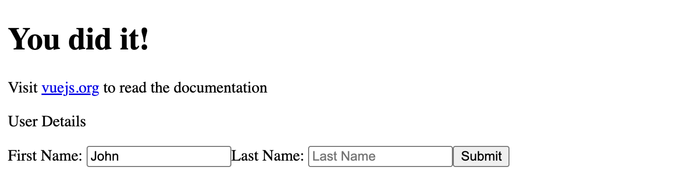
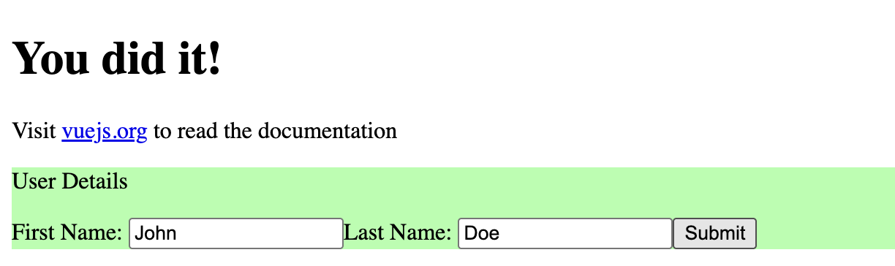

If you haven't read the previous article, I have a 3 part series about my journey to learning Vue.js. The purpose of this initiative is to learn just enough so that I'll be able to build and deploy a simple app with Vue.js.

Read the previous post here: [https://lostcause.dev/blog/learning-vue-part-1-getting-started](https://lostcause.dev/blog/learning-vue-part-1-getting-started)

## Let's build the app

Until now, we have a working app, and I also created a `Button` component that increments a number.

I'm too impatient, so let's skip some topics for now, and learn more about building the app.

The simplest way to build the app is by running `npm run build`. The npm command runs `vite build` which builds the app. If we run this command, we end up having a working static HTML app.

There's one problem though: this build isn't ideal for SEO, because the bots aren't executing the JavaScript. Most often they only analyse the HTML:

```html
<!DOCTYPE html>
<html lang="">
  <head>
    <meta charset="UTF-8">
    <link rel="icon" href="/favicon.ico">
    <meta name="viewport" content="width=device-width, initial-scale=1.0">
    <title>Vite App</title>
    <script type="module" crossorigin src="/assets/index-ym-c9gok.js"></script>
  </head>
  <body>
    <div id="app"></div>
  </body>
</html>
```

If we create a component in Vue that contains page details, it'll be available only after executing the JavaScript code (in this case `index-ym-c9gok.js` which is a minified version of the app).

## So how do we make it SEO friendly?

I found two solutions: one that's simpler, and another one that implies learning Nuxt.

Even though Nuxt is a well known framework, I'm willing to learn this after building the simple app with Vue. So I think I'll pick the first option.

I asked Claude, and it said that the simple solution is actually *the right approach*. I have doubts, but for how, if it works, I'll stick to it.

So what's the simple solution? I assume that if I add the SEO keywords (or basically any tag) directly in the `index.html` , they should appear in the final build. Let's see if it works 🤞

This is the new `index.html`, containing the new `title`, `og:title` and `og:description` tags:
```html
<!DOCTYPE html>
<html lang="">
  <head>
    <meta charset="UTF-8">
    <link rel="icon" href="/favicon.ico">
    <meta name="viewport" content="width=device-width, initial-scale=1.0">
    <title>Simple Vue Tool</title>
    <meta property="og:title" content="Simple Vue Tool">
    <meta property="og:description" content="Simple Tool built with Vue while learning the library">
  </head>
  <body>
    <div id="app"></div>
    <script type="module" src="/src/main.js"></script>
  </body>
</html>
```

And this is the built `index.html`:

```html
<!DOCTYPE html>
<html lang="">
  <head>
    <meta charset="UTF-8">
    <link rel="icon" href="/favicon.ico">
    <meta name="viewport" content="width=device-width, initial-scale=1.0">
    <title>Simple Vue Tool</title>
    <meta property="og:title" content="Simple Vue Tool">
    <meta property="og:description" content="Simple Tool built with Vue while learning the library">
    <script type="module" crossorigin src="/assets/index-ym-c9gok.js"></script>
  </head>
  <body>
    <div id="app"></div>
  </body>
</html>
```

So it worked 🎉
## Forms, props and emits

What really helped me understand these topics is the experience I accumulated while writing Angular and React code.

The principles kind of apply to the majority of frameworks. If you're new to this, maybe give it a bit more time.

I spent some more time reading the documentation and trying things out, and I have a working form. Check it out:

```html
<script setup>
    import { ref } from 'vue'

    const emit = defineEmits(['onFormSubmit']);
    const props = defineProps(['initialFirstName', 'initialLastName']);

    const firstName = ref(props.initialFirstName);
    const lastName = ref(props.initialLastName);
    const submitted = ref(false);

    function onFormSubmit() {
        submitted.value = true;

        const payload = {
            firstName: firstName.value,
            lastName: lastName.value
        };

        emit('onFormSubmit', payload);
    }
</script>

<template>
    <form @submit.prevent="onFormSubmit" :class="submitted ? 'submitted' : ''">
        <p>User Details</p>
        <label>First Name: <input type="text" name="firstName" placeholder="First Name" v-model="firstName" /></label>
        <label>Last Name: <input type="text" name="lastName" placeholder="Last Name" v-model="lastName" /></label>
        <button type="submit">Submit</button>
    </form>
</template>

<style scoped>
    .submitted {
        background: #aaffaa;
    }
</style>
```

And this is how the Form component can be loaded:

```
<Form @on-form-submit="formSubmitHandler" initial-first-name="John" />
```

This is how it looks before submitting the form (do notice the initial value that's been passed for first name input):



And after submitting the values:



These are some topics you might want to check out:
- **defineEmits** - this is one way of defining event emitters in the child component to send a value to the parent component. In the example above, the values from the form are passed to the parent component through the event emitter called `onFormSubmit`
- **defineProps** - this is the way of passing values from the parent component to the child component. Based on the documentation, this is a well known pattern: passing the initial value on a prop, then doing the calculation within the child component
- **@submit.prevent** - this is a form event emitter we use to change the initial behaviour of the form: we want to handle the form submission in our function, and this is how we do it
- **:class** - by using this attribute, we can toggle a class on the form tag whenever the `submitted` ref is true

These are some basic features of Vue, and I think they are a great starting point. I definitely need to take a deeper look at more properties that are available in Vue, and that's what I recommend you do as well.

## Recap

So let's review what we achieved so far:

- **✅ Understanding project structure** - This got addressed in the previous post.
- **✅ Basic features (rendering values, calling out functions)** - Now we have a better understanding of how to pass values from one component to another and how to attach different handlers.
- **✅ Component creation and usage** - We created more components, and for the purpose of building a simple app this should be alright.
- **✅ Capturing user input** - So far we captured click event, form submit, and also input change. It's a good start.
- **✅ Build process** - Here we'll follow the *simple solution*: passing the SEO meta tags directly to the `index.html`. For more advanced use cases, I think using Nuxt is required.

Thank you for reading, and I'm so excited to put into practice what we learned. In the next post we'll build a small tool with what we learned, so definitely stay tuned!
