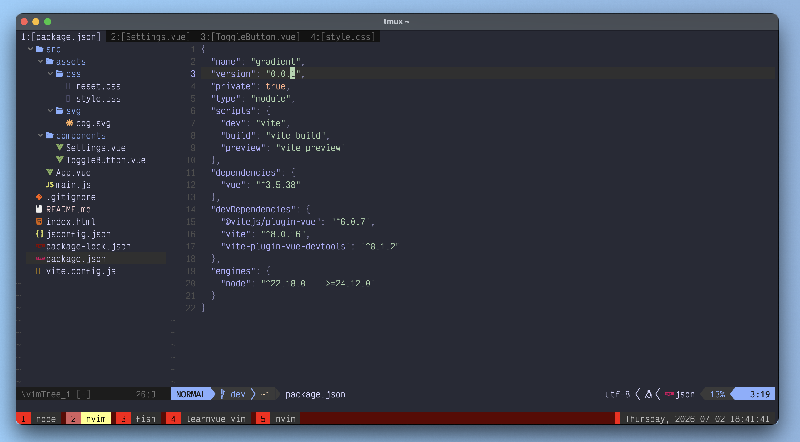
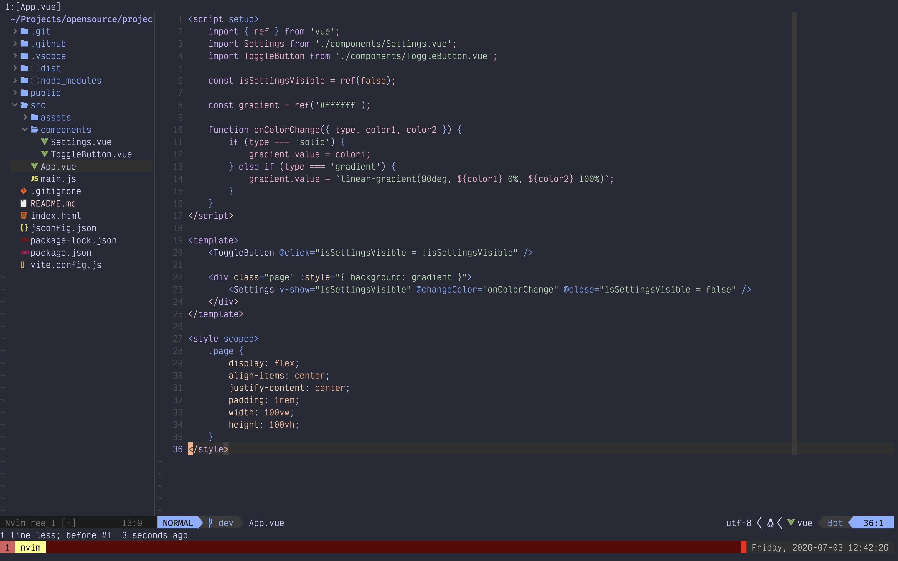
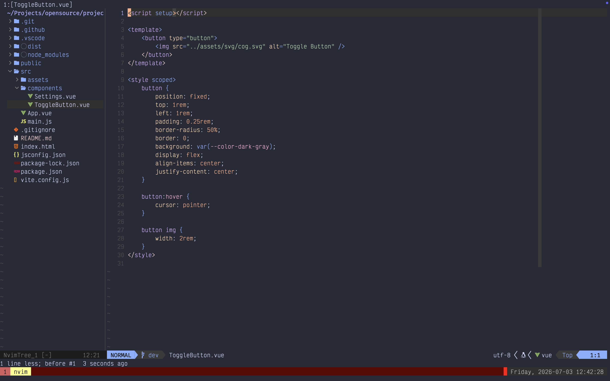
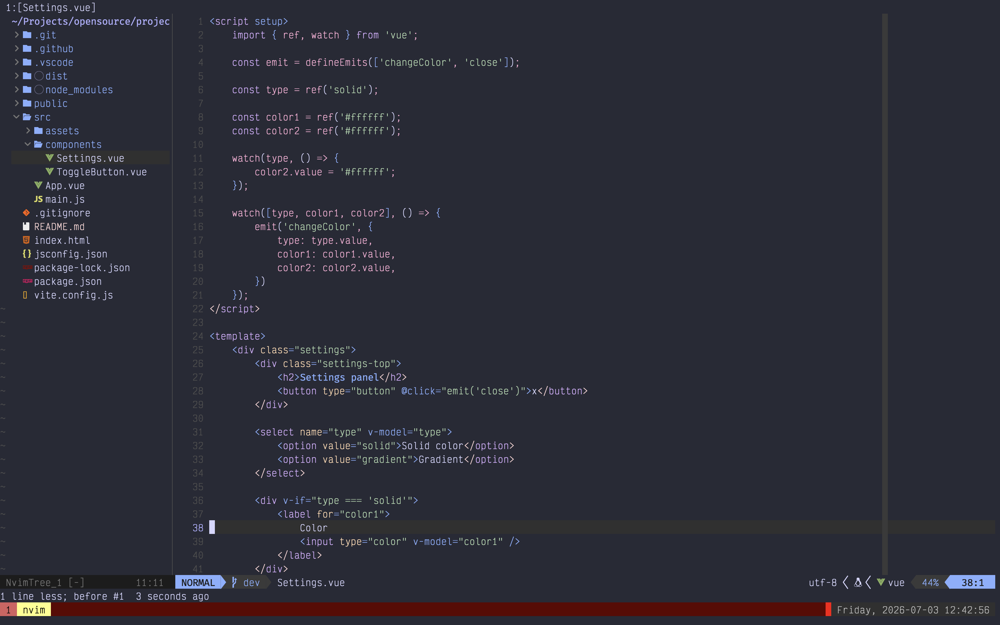
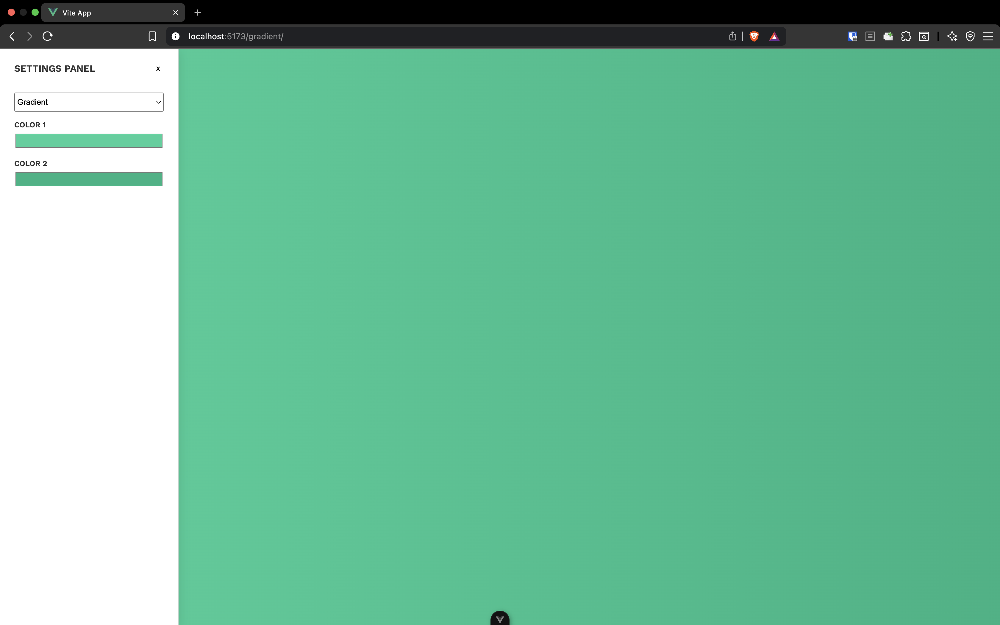

If you haven't read the previous articles, I have a 3-part series about my journey to learning Vue.js. The purpose of this initiative is to learn just enough so that I'll be able to build and deploy a simple app with Vue.js.

Read the previous posts here:

- [https://lostcause.dev/blog/learning-vue-part-1-getting-started](https://lostcause.dev/blog/learning-vue-part-1-getting-started)
- [https://lostcause.dev/blog/learning-vue-part-2-expanding-my-knowledge](https://lostcause.dev/blog/learning-vue-part-2-expanding-my-knowledge)

This is the last post in the series, and I'm describing the steps of building a working mini app and some technical considerations.

In case you want to skip reading the articles, here are some useful links for you:

- Github Repo: [https://github.com/razvanmtn/gradient](https://github.com/razvanmtn/gradient)
- Deployed version: [https://razvanmtn.github.io/gradient/](https://razvanmtn.github.io/gradient/)
## The project idea

I'm a developer and a content creator. Taking many screenshots led me to this idea: I need a small web app that helps me generate wallpapers and gradients. This is the perfect opportunity to put my Vue.js skills to the test.

The purpose of the app: configuring a backdrop to make the process of taking screenshots way easier. The background should be either a solid color or a gradient, and render it across the whole width and height of the web app, so that whenever I want to take a screenshot of a window on my computer, I can place it on the gradient for a better look (see the screenshot below).

## Components

I organized the whole app into 3 components:
### App.vue

- this is the entry point
- whenever the properties in the settings popup change, the `onColorChange` handler gets called and it updates the background color of the whole page
- toggling the settings popup is done by clicking on the `ToggleButton`. When clicked, it changes the `isSettingsVisible` flag, which shows or hides the popup
- in order to persist the values of the Settings modal even after closing it, I'm using the `v-show` directive. The modal remains mounted in the DOM and gets hidden once the toggle button is clicked. The difference between `v-show` and `v-if` is that `v-if` removes the modal from the DOM completely. Anytime the component is remounted, it gets reinitialized: it's a new component and does not persist the previous state.
### ToggleButton.vue

- this is a simple rounded icon button containing a cog SVG
- I want it fixed at the top left of the screen
- the click event is attached to the component itself, in `App.vue` directly, not on the button

### Settings.vue

- this is the component responsible for background configuration
- there are 2 refs: `color1` and `color2`. Based on the type `solid` or `gradient`, these colors are rendered in the settings panel, and 1 or 2 color pickers appear
- the watcher on line 15 is called whenever `type`, `color1`, or `color2` values change. When any of the variables change, the parent component (in this case `App.vue`) is notified

## Further improvements

These are some further improvements I consider:
- configuring gradient direction from the settings popup
- adding a custom color palette, with some common colors users might use besides the default color picker

If you followed along and enjoy the project, you can:
- fork the repository and add some more features
- raise a PR - I would be so glad to check it out

