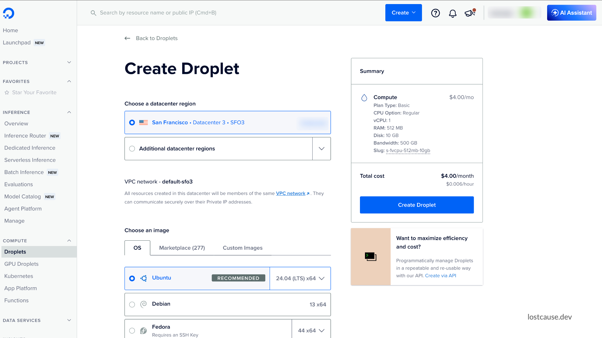
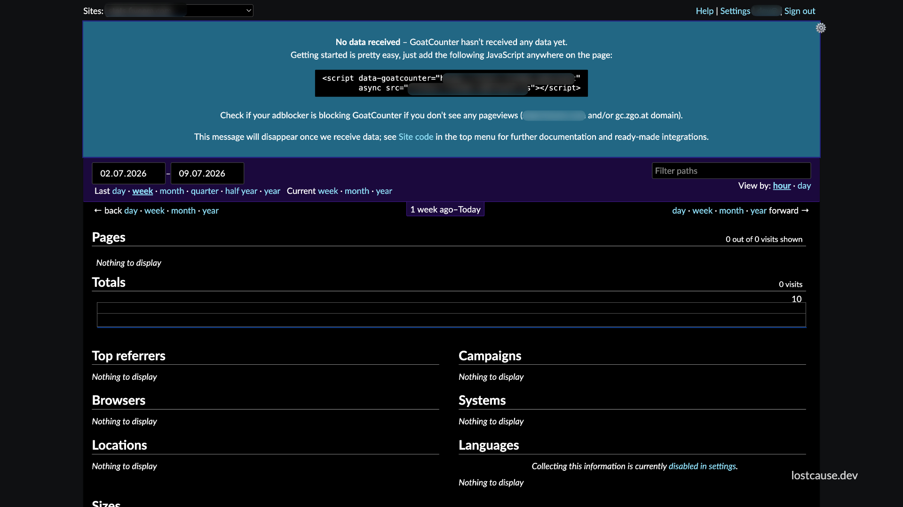

In this blog post, we'll explore a way of configuring a full self-hosted analytics solution with GoatCounter on a DigitalOcean droplet.

I tried to find an affordable solution for analytics. There are a bunch of options: Google Analytics, Plausible, Simple Analytics, Umami.

Google Analytics is too complex and hard to understand. It's also overkill for my needs.

Regarding the others, all of them are viable options, but some cost too much.

For 1, 2, or 5 websites, the free tier can be a viable option. There are also affordable options for like 10 apps. But what if we have even more apps?

If you're like me, willing to build tens of small static websites and mini tools, costs add up so much. The small mini tools won't have a ton of traffic, and I won't be able to monetize them that easily to justify the expenses.

The solution is simple: self-hosting.

## Infrastructure

DigitalOcean is my provider of choice. Their cheapest option is a $4/month VPS that offers 1 vCPU, 512MB RAM and 10GB SSD. I'd like to use that if possible.

There are 2 well-known self-hosting solutions: Plausible and Umami.

Based on the chat I had with Claude, Plausible requires more computing power to run properly. Umami can work alright, but based on what Claude said, it works well with low traffic. In case one app has heavier traffic, the whole solution won't be as reliable and stable. I didn't test these things on my own, though. But it proposed a different option that I'm willing to try: [GoatCounter](https://github.com/arp242/goatcounter).

## Step 1: VM/Droplet creation

For this use case, a $4/month droplet running Ubuntu 24.04 LTS should work just fine.

Creating one can be done directly in the DigitalOcean dashboard. Depending on updates, the interface might look different:


## Step 2: Non-root sudo user creation

We don't want to use the root to run everything. This is a well-known security practice. In case of a compromise, the newly created user has limited permissions.

This is how we can create a user with sudo permissions:

```bash
ssh root@<droplet-ip>

apt update && apt upgrade -y

# create a non-root sudo user
adduser deployuser
usermod -aG sudo deployuser

# setting up a password for the user for recovery
passwd deployuser

# setting up swap: a safety net on 512MB RAM so memory spikes
# slow things down instead of getting processes killed outright
fallocate -l 1G /swapfile
chmod 600 /swapfile
mkswap /swapfile
swapon /swapfile
echo '/swapfile none swap sw 0 0' >> /etc/fstab

# blocks SSH brute-force attempts
apt install fail2ban -y
```

Now logging in as `deployuser` and using `sudo` should be possible:

```bash
ssh deploy@<droplet-ip>
sudo whoami   # should print "root" after entering deploy's password
```

## Step 3:  Cloud Firewall setup

These are the rules we want for the firewall:

- **Inbound Rules:** HTTP (port 80) and HTTPS (port 443), both with Sources set to "All IPv4" / "All IPv6".
- **Outbound Rules**: the default configuration (all traffic allowed outbound).

At this point, port 22 is closed, and 80/443 are open.

I don't SSH into the VPS very often. So whenever I want to do so, I'll login to the Digital Ocean dashboard and add a new rule to enable port 22 for my IP. That's an extra safety precaution I took.

## Step 4: DNS configuration

In order to setup analytics, owning one domain is required. We need a subdomain pattern, e.g. `*.stats.yourdomain.com`. Each individual app would use a subdomain that looks like this: `app1.stats.yourdomain.com`, `app2.stats.yourdomain.com` and so on.

Let's add an A record for the first domain (we'll add the rest as we onboard each app):

```
stats.yourdomain.com   A   <your-droplet-ip>
```

## Step 5: GoatCounter installation

⚠️ This bash script was suggested by Claude. It is what I ran when I installed my solution.

The installation process will most probably change in the future, so better check the official [GoatCounter Documentation](https://www.goatcounter.com/help/start) or ask AI for some help.

```bash
cd /opt
sudo wget https://github.com/arp242/goatcounter/releases/download/v2.7.0/goatcounter-v2.7.0-linux-amd64.gz
sudo gunzip goatcounter-v2.7.0-linux-amd64.gz
sudo mv goatcounter-linux-amd64 /usr/local/bin/goatcounter
sudo chmod +x /usr/local/bin/goatcounter
```

GoatCounter runs a local sqlite3 database. This is how one is created:

```bash
sudo mkdir -p /opt/goatcounter/db
cd /opt/goatcounter

# creates the SQLite DB + your admin login for the first site
sudo goatcounter db create site -createdb \
  -db sqlite3:///opt/goatcounter/db/goatcounter.sqlite3 \
  -vhost stats.yourdomain.com \
  -user.email you@yourdomain.com
  
sudo chown -R www-data:www-data /opt/goatcounter
```

It'll ask to set a password for dashboard login. This should be separate from the one on Step 2, when we configured the droplet user.

## Step 6: Running GoatCounter as a systemd service

Let's create a systemd configuration file `/etc/systemd/system/goatcounter.service`:

```ini
# /etc/systemd/system/goatcounter.service
[Unit]
Description=GoatCounter analytics
After=network.target
StartLimitIntervalSec=60
StartLimitBurst=5

[Service]
User=www-data
ExecStart=/usr/local/bin/goatcounter serve \
  -listen localhost:8081 \
  -tls none \
  -db sqlite3:///opt/goatcounter/db/goatcounter.sqlite3
Restart=always
RestartSec=5

[Install]
WantedBy=multi-user.target
```

To load the configuration and check that everything is properly configured, run the following lines:

```bash
sudo systemctl daemon-reload
sudo systemctl enable --now goatcounter
sudo systemctl status goatcounter   # confirm it's running
```

## Step 7: Caddy reverse proxy installation

[Caddy](https://caddyserver.com/) is a lightweight reverse proxy that can automatically manage TLS certificates.

These are the commands we need to run to install Caddy:

```bash
sudo apt install -y debian-keyring debian-archive-keyring apt-transport-https
curl -1sLf 'https://dl.cloudsmith.io/public/caddy/stable/gpg.key' | sudo gpg --dearmor -o /usr/share/keyrings/caddy-stable-archive-keyring.gpg
curl -1sLf 'https://dl.cloudsmith.io/public/caddy/stable/debian.deb.txt' | sudo tee /etc/apt/sources.list.d/caddy-stable.list
sudo apt update && sudo apt install caddy -y
```

Once installed, let's create the Caddy configuration file `/etc/caddy/Caddyfile`:

```
# /etc/caddy/Caddyfile
stats.yourdomain.com {
    reverse_proxy localhost:8081
}
```

Let's restart the service:

```bash
sudo systemctl reload caddy
```

Caddy automatically requests and renews a Let's Encrypt certificate for `stats.yourdomain.com` the first time it loads this config, as long as the DNS record from Step 4 is already resolving to your Droplet.

We should be good to go. Let's open `https://stats.yourdomain.com` and log in with the dashboard credentials (the ones configured at Step 5).


## Step 8: Adding more domains

So we have the default installation ready. Now it's time to add more subdomains for each app we want to track.

The way we do this is:

1. In the GoatCounter dashboard, we should go to **Settings → Sites → Add site**, provide a name, and set its vhost (e.g. `app2.stats.yourdomain.com`).
2. We need an A record for that subdomain pointing to the same Droplet IP (similar to what we did in Step 4, but we use `app2.stats.yourdomain.com` this time).
3. Update the Caddyfile and reload Caddy. More domains can be listed in one block and Caddy fetches a separate certificate for each one:

```
# /etc/caddy/Caddyfile
app1.stats.yourdomain.com,
app2.stats.yourdomain.com,
app3.stats.yourdomain.com {
    reverse_proxy localhost:8081
}
```

4. The last step is adding the tracking snippet to our app HTML:

```html
<script data-goatcounter="https://app2.stats.yourdomain.com/count"
        async src="//app2.stats.yourdomain.com/count.js"></script>
```

## Conclusions

For more configuration details, it's better to check the official Goat Counter documentation: https://www.goatcounter.com/help/start

We made it to the end 🎉

Huge congrats, and thank you for checking out this post!

